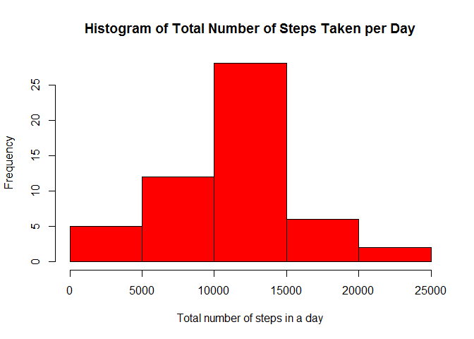
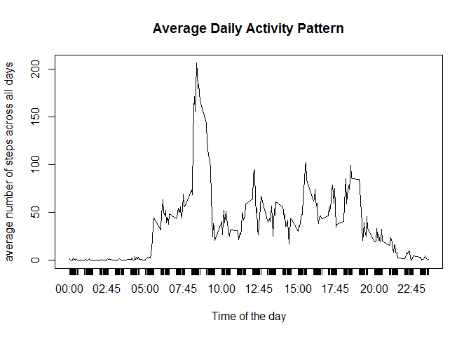
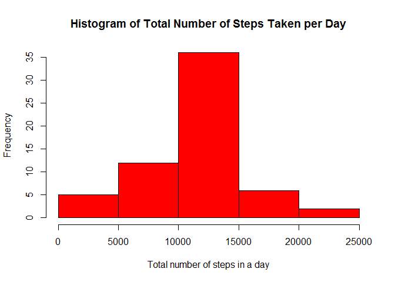
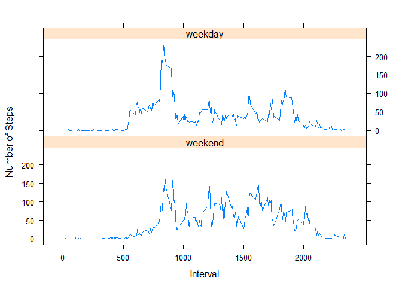

# Reproducible Research: Peer Assessment 1
For writing the code in the R markdown, we always use echo = TRUE so that someone else will be able to read the code.We also call package Knitr to convert the R markdown to html.
       

```r
#Preparing R environment
library(knitr)
```

```
## Warning: package 'knitr' was built under R version 3.2.3
```

```r
opts_chunk$set(echo = TRUE, results = 'hold')
```

Then before starting the main body of code, I set my working directory to the folder where data is available:

```r
#Set the working directory to desired folder
setwd("d:\\datascience\\reproducibleresearch\\Assignment1\\repdata_peerassessment1")
```
## Loading and preprocessing the data

This assignment makes use of data from a personal activity monitoring device. This device collects data at 5 minute intervals through out the day. The data consists of two months of data from an anonymous individual collected during the months of October and November, 2012 and include the number of steps taken in 5 minute intervals each day. 
I use read.csv() function to read the activity data into R.


```r
activity_data<-read.csv("activity.csv")
```

## What is mean total number of steps taken per day?

According to assignment instruction we can ignore the missing values for this part.I used aggregate() function to calculate the total number of steps per day. 


```r
#Calculating the total number of steps taken per day
agg_data<-aggregate(steps~date,data=activity_data,sum)
head(agg_data)
```

```
##         date steps
## 1 2012-10-02   126
## 2 2012-10-03 11352
## 3 2012-10-04 12116
## 4 2012-10-05 13294
## 5 2012-10-06 15420
## 6 2012-10-07 11015
```

Now I make a simple histogram for the total number of steps taken each day


```r
#Making a histogram of the total number of steps taken each day
hist(agg_data$steps,col=2,main="Histogram of Total Number of Steps Taken per Day",xlab="Total number of steps in a day")
```

\

Now I calculate the mean and median of of the total number of steps taken per day.


```r
#Calculating and reporting mean and median of steps taken each day
step_median<-median(agg_data$steps)
print(paste("step_median:",step_median))
step_mean<-mean(agg_data$steps)
print(paste("step_mean:",step_mean))
```

```
## [1] "step_median: 10765"
## [1] "step_mean: 10766.1886792453"
```

## What is the average daily activity pattern?

I Make a time series plot of the 5-minute interval (x-axis) and the average number of steps taken, averaged across all days (y-axis)


```r
#calculating average number of steps in each 5-minutes interval,
#across all days

aspi1<-aggregate(steps~interval,data=activity_data,FUN=mean) #aspi stands for Average Steps Per Interval
```

I decided to convert the 5_minutes interval to Time format for better understanding the plot.


```r
#converting 5-minutes intervals to 00:00 time format

temp <- sprintf("%04d", aspi1$interval)
aspi1$dfi<-format(strptime(temp, format="%H%M"), format = "%H:%M")         #dfi stands for Desired Format Intervals

#make a time series plot 
plot(aspi1$interval,aspi1$steps,type="l",xaxt="n",main="Average Daily Activity Pattern",xlab="Time of the day",ylab="average number of steps across all days")
axis(1,at=aspi1$interval,labels=aspi1$dfi)
```

\

Which 5-minute interval, on average across all the days in the dataset, contains the maximum number of steps?
As I mentioned before I have converted the 5_minute intervals to time format,therefore I report the "time" with maximum number of steps.


```r
#reporting the time of 5_minutes interval that contains the maximum number of steps(average across all days)
max_steps<-max(aspi1$steps)
max_interval<-aspi1[which(aspi1$steps==max_steps),]
print(paste("5_min Interval that contains the maximum number of steps:",max_interval$dfi))
print(paste("The total number of steps in this interval is:",max_steps))
```

```
## [1] "5_min Interval that contains the maximum number of steps: 08:35"
## [1] "The total number of steps in this interval is: 206.169811320755"
```

## Imputing missing values

Total number of missing values:


```r
#Calculatinge and reporting the total number of missing values in the datase             
na_number<-sum(!complete.cases(activity_data))
print(paste("Total number of rows with N.A:",na_number))
```

```
## [1] "Total number of rows with N.A: 2304"
```

Strategy for filling in all of the missing values in the dataset:
I chose to fill the missing values with mean of steps of related 5_minute interval.I used a for loop for filling NA values.


```r
#creating new dataset with filling in all of the missing values in the dataset with mean of the intervals

step_mean <- aggregate(steps ~ interval, data = activity_data,mean,na.rm=TRUE)
new_act_data<-activity_data
for (i in 1:nrow(activity_data)) {
     each_row <-activity_data[i, ]
     if (is.na(each_row$steps)) {
         each_row$steps<-step_mean[which(step_mean$interval==each_row$interval), 2]
     }
     new_act_data[i,]<-each_row
}
head(new_act_data)
```

```
##       steps       date interval
## 1 1.7169811 2012-10-01        0
## 2 0.3396226 2012-10-01        5
## 3 0.1320755 2012-10-01       10
## 4 0.1509434 2012-10-01       15
## 5 0.0754717 2012-10-01       20
## 6 2.0943396 2012-10-01       25
```

Now I check if ther is still any missing value in new data frame.The sum of NA should return zero:


```r
sum(is.na(new_act_data))
```

```
## [1] 0
```
Which is correct!

A histogram of the total number of steps taken each day:

```r
#Making a histogram of the total number of steps taken each day
new_agg_data<-aggregate(steps~date,data=new_act_data,sum)
hist(new_agg_data$steps,col=2,main="Histogram of Total Number of Steps Taken per Day",xlab="Total number of steps in a day")
```

\

Calculate and report the mean and median total number of steps taken per day. Do these values differ from the estimates from the first part of the assignment? What is the impact of imputing missing data on the estimates of the total daily number of steps?


```r
#Calculating and reporting the mean and median total number of steps taken per day

new_step_median<-median(new_agg_data$steps,na.rm=TRUE)
print(paste("new_step_median:",new_step_median))
new_step_mean<-mean(new_agg_data$steps,na.rm=TRUE)
print(paste("new_step_mean:",new_step_mean))
```

```
## [1] "new_step_median: 10766.1886792453"
## [1] "new_step_mean: 10766.1886792453"
```

The new mean and median afetr filling th NA values differ just slightly from previous mean and median:

    Before filling the data
        Mean : 10766.189
        Median: 10765

    After filling the data
        Mean : 10766.189
        Median: 10766.189

## Are there differences in activity patterns between weekdays and weekends?
I created a new factor variable in the dataset with two levels - "weekday" and "weekend" indicating whether a given date is a weekday or weekend day.


```r
#Creating a new factor variable in the dataset with two levels "weekday" and "weekend"
new_act_data$date<-as.POSIXct(new_act_data$date)
weekday <- c('Monday', 'Tuesday', 'Wednesday', 'Thursday', 'Friday')
new_act_data$WDay<-factor((weekdays(new_act_data$date)%in%weekday),
                           levels=c(FALSE,TRUE),labels=c("weekend","weekday"))
```

I made a panel plot containing a time series plot (i.e. type = "l") 
of the 5-minute interval (x-axis) and the average number of steps taken,
averaged across all weekday days or weekend days (y-axis).


```r
#Using lattice system for plotting
aspi2<-aggregate(steps~interval+WDay,data=new_act_data,FUN=mean)
library(lattice)
p2<-xyplot(steps~interval|WDay,data=aspi2,type="l",layout=c(1,2),xlab="Interval",
           ylab="Number of Steps")
print(p2)
```

\
From the graphs we can see that activity on the weekday has high peak in mostly all intervals. But, the activity peak for weekends is almost one hundred steps more than weekdays. This could be because on weekend the person has more free time to do some more activity.On the other hand, on weekends the distribution of sctivity along the time is better.
